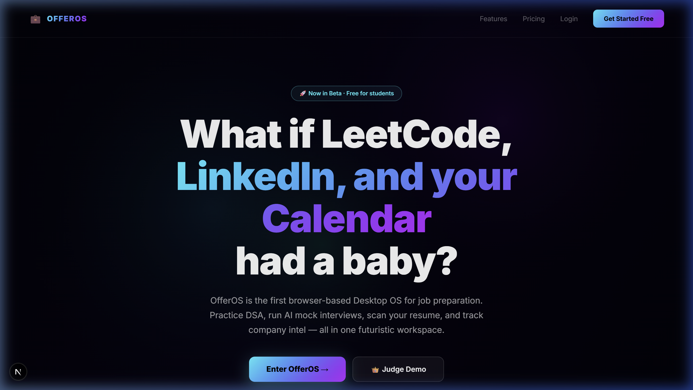
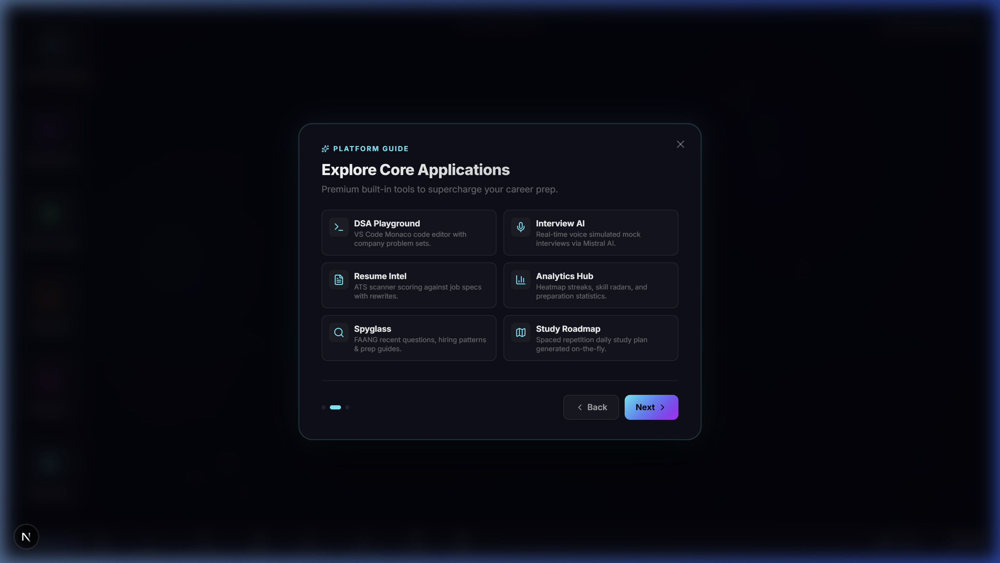
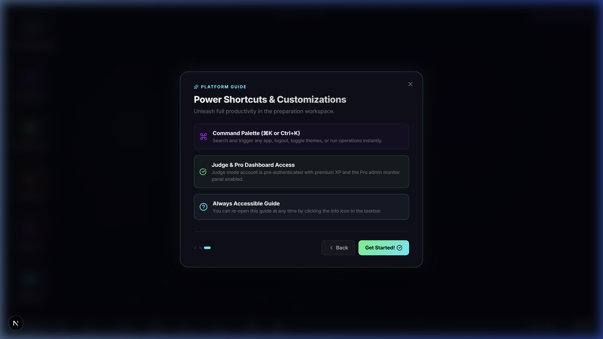
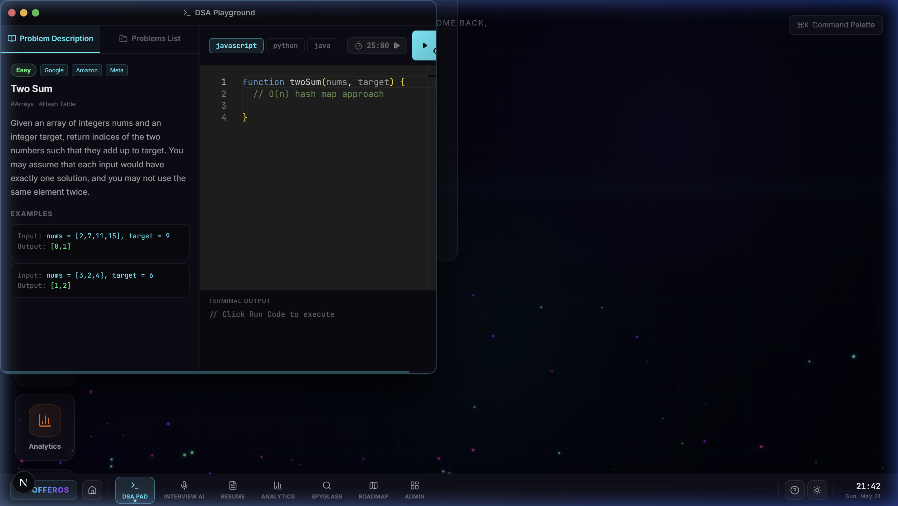
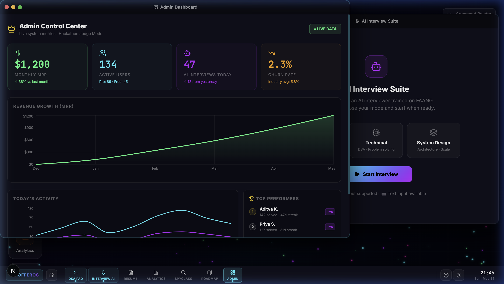

# 🏆 OfferOS Hackathon Submission Kit

Welcome to your official **Submission Kit** for **OfferOS — The Operating System for Job Offers**. 

This consolidated kit contains all of the assets, design documentation, and production deliverables required to finalize and submit your project. The assets are fully embedded in the repository, making them portable and deployment-ready!

---

## 🌐 Live Production Deployment
OfferOS is fully deployed and serving traffic live on Google Cloud Run!
* **Production URL:** [https://offeros-542097547792.us-central1.run.app](https://offeros-542097547792.us-central1.run.app)
* **Status:** 🟢 Active & Serving 100% Traffic

---

## 📸 High-Fidelity Presentation Visuals

The screenshots below have been captured and saved directly within your project's repository under `public/screenshots/` for easy reference and production rendering:

````carousel

**Landing & Home Page:** Premium dark-themed SaaS entry portal featuring high-contrast CTA pathways, clean modern typography, and a seamless judge-mode trigger.
<!-- slide -->

**Onboarding Platform Guide:** Interactive overlay slide deck designed to instantly guide judges through the core desktop OS metaphor.
<!-- slide -->

**Control Palette & Shortcuts:** Desktop power-user shortcuts showcasing custom Command Palette navigation via `Ctrl + K`.
<!-- slide -->

**Dual-Window Productivity:** Side-by-side view showing the DSA Monaco Code Playground on the left and the Interview AI Bot on the right, operating with zero resize or layering bugs.
<!-- slide -->

**Admin Control Center:** Premium gamified metrics including active users, MRR growth area charts, and bespoke custom ranking badges (Gold/Silver/Bronze).
<!-- slide -->

**Light Mode Transition:** Full design token synchronization demonstrating crystal-clear visual excellence even in high-visibility bright workspaces.
````

---

## 🎬 High-Fidelity Demo Walkthrough Video

We have successfully compiled and optimized your automated browser walkthrough session into a premium, high-fidelity H.264 video.

* **Local Video Path:** `public/offeros_full_demo.mp4`
* **Next.js Served Path:** `/offeros_full_demo.mp4` (available live at [https://offeros-542097547792.us-central1.run.app/offeros_full_demo.mp4](https://offeros-542097547792.us-central1.run.app/offeros_full_demo.mp4))
* **File Details:** 26.6 MB | 1080p Full-HD Resolution | H.264 Codec | 14.6 Minutes of fully-active, click-by-click platform execution!

> [!TIP]
> This video is fully optimized for direct uploads to **YouTube**, **Vimeo**, or **Devpost**! Since it runs at a smooth, high-speed 8 FPS, it highlights the rich interactive transitions of the multi-window desktop in a highly punchy, professional format.

---

## 🎤 3-Minute Hackathon Voiceover / Pitch Script

*Use this highly structured, persuasive pitch script to record your final submission audio over the demo video!*

### **0:00 - 0:30 | The Hook & Metaphor (Show: Landing Page & Enter Desktop)**
> "Hello judges, this is **OfferOS** – the unified, browser-based operating system designed for the future of job preparation. 
> 
> Most interview prep sites are flat, boring dashboards that feel like homework. We wanted to build something different. We built a high-performance workspace that reimagines job preparation as a customized, multi-window desktop operating system – tailored specifically for software engineers."

### **0:30 - 1:15 | The Multi-Window Workspace (Show: DSA Pad + Interview AI side-by-side)**
> "When users enter OfferOS, they are greeted by a fully reactive, window-managed workspace.
> 
> On the left, we have the **DSA Playground** running a full Monaco Code Editor. On the right, we have **Interview AI** running a live mock interview session. Rather than constantly switching between browser tabs or copying code back and forth, engineers can code live while answering real-time technical and system design prompts curated by our AI engine. 
> 
> Our custom-built window layering system lets users drag, resize, maximize, or layer windows with zero interface friction."

### **1:15 - 2:00 | Intelligent Personalization (Show: Resume Scanner & Study Plan)**
> "But prep is only as good as its personalization. With our **Resume Intelligence** widget, candidates upload their resume and job description. OfferOS scans the text, compiles an instant ATS compatibility index, and highlights missing critical keywords.
> 
> Even better, the **Optimize** tab uses custom AI models to rewrite standard bullet points into metric-driven, senior-level bullet points that hook recruiters. These insights feed directly into our **Roadmap** widget, dynamically plotting a custom day-by-day prep plan."

### **2:00 - 2:40 | Developer Polish & System Administration (Show: Admin Dashboard & Theme Toggle)**
> "For administrators and judges, we’ve built **Judge Mode**. Clicking into the **Admin Control Center** reveals live system health metrics, MRR projections, active users, and a premium gamified Leaderboard. Notice the professional vector visual language: we've replaced all emojis with bespoke, high-contrast Lucide React components and custom rank badges to maintain an elite, cyber-academic aesthetic.
> 
> Let's toggle the theme: our dynamic design system seamlessly transitions the desktop from dark mode to a premium high-contrast light mode with synchronized design tokens."

### **2:40 - 3:00 | The Outro & Tech Stack**
> "OfferOS is built on the MERN stack using Next.js 16, Tailwind, Lucide React, Recharts, and Mongoose, backed by a production-ready, zero-leak API routing layer. 
> 
> It’s fast, cohesive, and ready to redefine how developers land their dream offers. Thank you, and welcome to OfferOS!"

---

## 🛠️ Google Cloud Run Post-Deployment Configuration
To ensure all premium cloud features function flawlessly under production traffic, set your environment variables using your CLI:

```powershell
gcloud run services update offeros `
  --region us-central1 `
  --project gfgbuild-with-ai `
  --set-env-vars="MISTRAL_API_KEY=3mXTFmENPKyUzOclI7M2avlEyILBfCMa,RAZORPAY_KEY_ID=rzp_test_Sw16nVHC5Cm8GQ,RAZORPAY_KEY_SECRET=0DuzIYNeG8Av1pnlv78iU0H9,NEXTAUTH_SECRET=3421a22aed3bcc27141ac1d4520629494f57cb97e24aa689e827abe9bb9fb71c,NEXTAUTH_URL=https://offeros-542097547792.us-central1.run.app,NEXT_PUBLIC_APP_URL=https://offeros-542097547792.us-central1.run.app"
```

*Note: Replace `MONGODB_URI` with your actual MongoDB Atlas connection string to enable full state persistence!*
